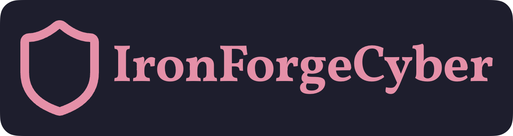

# 

**Cybersecurity Education, Resources, and Research — built for hackers, by hackers.**

We create high-quality, hands-on material to teach computer science, reverse engineering, and real-world cybersecurity techniques through:

- 🧠 **Courses** — Structured content that dives deep into technical topics
- 🔍 **CTF Challenges** — Interactive problems focused on exploitation, analysis, and tooling
- 📚 **Resources** — Quick references, guides, and curated knowledge dumps
- 📝 **Blogs** — Explorations, breakdowns, and commentary on everything from firmware to frontends

## 🚧 In Progress

We're actively building out:

- User progress tracking across all content
- A public challenge platform with automated scoring
- More course content on binary exploitation, Linux internals, and secure code review

## 🤝 Contributing

Want to write a blog post? Want to contribute course content? Feel free to reach out!

- 🌐 [ironforgecyber.com](https://ironforgecyber.com)
- 📬 Contact: `contact@ironforgecyber.com`
- 🗨️ Want to contribute or collaborate? Open an issue or reach out directly.
